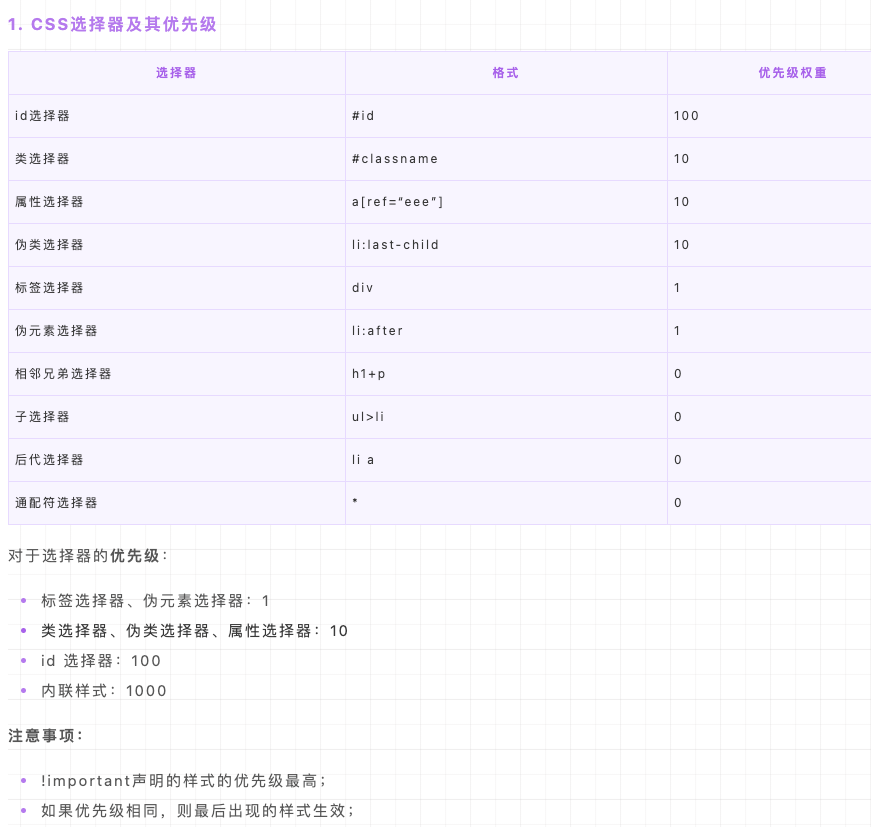
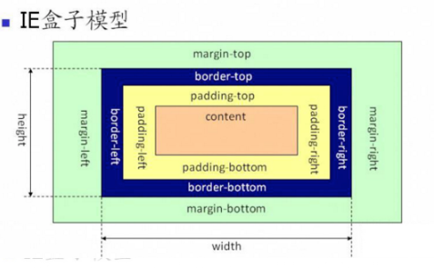
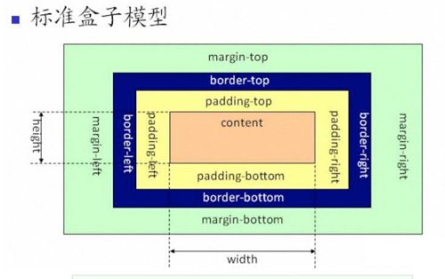

# CSS

## 高频

1. css3新增特性
2. flex1的意义
3. css垂直居中有哪些方法
4. css两栏布局,左侧固定，右侧自适应
5. 伪元素伪类是什么，常用的有哪些
6. 重排和重绘是什么，哪些会引起重排重绘
7. BFC是什么？触发BFC的条件是什么？有哪些应用场景
8. css选择器有哪些，权重如何计算？
9. 说一下flex布局有哪些属性
10. 响应式布局用到的技术？移动端要注意什么
11. css两种盒模型
12. link和import区别
13. position都有哪些属性

## 非高频

1. 画一个三角形
2. css清除浮动的方法
3. em和px的区别

## 高频问题回答

### css3新增特性

- transition过渡
- transform变换
- opacity透明度
- border-radius圆角

### flex1的意义

flex: 1; === flex: 1 1 0%; （自适应）， 是flex-grow/flex-shrink/flex-basis的缩写

- 第一个参数表示: flex-grow     定义项目的放大比例，默认为0，即如果存在剩余空间，也不放大
- 第二个参数表示: flex-shrink     定义了项目的缩小比例，默认为1，即如果空间不足，该项目将缩小
- 第三个参数表示: flex-basis给上面两个属性分配多余空间之前,     计算项目是否有多余空间, 默认值为 auto, 即项目本身的大小

flex默认值为0 1 auto,flex: auto表示1 1 auto

### css垂直居中有哪些方法

```html
   <div class="container">
      <div class="son"></div>
    </div>
```

```css
	//top,left50%,transform迁移半个身位
    .container {
	  background-color: aqua;
	  height: 100%;
	  width: 100%;
	}
	.son {
	  position: absolute;
	  background-color: brown;
	  left: 50%;
	  top: 50%;
	  width: 100px;
	  height: 100px;
	  transform: translate(-50%, -50%);
    }

  //子元素所有方向都为 0 ，将 margin  设置为 auto ，由于宽高固定，对应方向实现平分
(两侧都是auto时，margin会将剩余空间平分)
    .container {
      background-color: aqua;
      height: 100%;
      width: 100%;
    position: relative
    }
    .son {
      position: absolute;
      top: 0;
      left: 0;
      right: 0;
      bottom: 0px;
      margin: auto;
      height: 100px;
      width: 100px;
      background-color: brown;
    }

   //flex布局
   .container {
      background-color: aqua;
      height: 100%;
      width: 100%;
      display: flex;
      justify-content: center;
      align-items: center;
    }
    .son {
      width: 100px;
      height: 100px;
      background-color: brown;
    }

   //grid布局
   .container {
      background-color: aqua;
      height: 100%;
      width: 100%;
      display: grid;
    }
    .son {
      width: 100px;
      height: 100px;
      background-color: brown;
      justify-self: center;
      align-self: center;
    }

   //flex + margin:auto
    .container {
      background-color: aqua;
      height: 100%;
      width: 100%;
      display: flex;
    }
    .son {
      width: 100px;
      height: 100px;
      background-color: brown;
      margin:auto;
    }
```


### css两栏布局

```html
<divclass="outer"> 
  <divclass="left">左侧</div> 
  <divclass="right">右侧</div> 
</div>
```

```css
//float + margin-left
.outer {
  background-color: aqua;
  height: 500px;
  overflow: hidden;
}
.left {
  float: left;
  width: 200px;
    height: 100%;
  background-color: chocolate;
}
.right {
  margin-left: 200px;
    height: 100%;
  background-color: crimson;
}

//BFC
.outer {
  background-color: aqua;
  height: 500px;
}
.left {
  float: left;
  width: 200px;
  height: 100%;
  background-color: chocolate;
}
.right {
  overflow: auto;
  height: 100%;
  background-color: crimson;
}

//flex 1
.outer {
  background-color: aqua;
  height: 500px;
  display: flex;
}
.left {
  width: 200px;
  height: 100%;
  background-color: chocolate;
}
.right {
  flex:1;
  height: 100%;
  background-color: crimson;
}
```


### 伪元素伪类是什么，常用的有哪些

**伪元素：**

用于创建一些不在DOM树中的元素，并为其添加样式。例如，我们可以通过:before来在一个元素之前添加一些文本，并为这些文本添加样式，虽然用户可以看见这些文本，但是它实际上并不在DOM文档中，因此，称为“伪”元素。

常用的有： ::before   ::after ::first-line

**伪类：**

将特殊的效果添加到特定选择器上。它是已有元素上添加类别的，不会产生新的元素

常用的有： :active :link :visited :first-child :placeholder


### 重排和重绘是什么，哪些会引起重排重绘

**回流（重排）：**

对 DOM 结构的修改引发 DOM 几何尺寸变化的时候,会发生回流过程。字面理解就是重新排列dom元素

**具体操作：**

- 一个 DOM     元素的几何属性变化，常见的几何属性有width、height、padding、margin、left、top、border 等等,
- 使 DOM 节点发生增减或者移动。
- 读写     offset族、scroll族和client族属性的时候，浏览器为了获取这些值，需要进行回流操作。

**重绘：**

元素样式发生改变，浏览器将新样式重新赋予元素并重新绘制。简单理解就是重新绘制dom元素。

只需要计算样式和绘制列表

**重绘不一定导致回流，但回流一定发生了重绘**

**如何减少重排重绘：**

1. 集中改变样式：将样式统一写在一个类名上，再将该类名加到属性上
2. 离线修改dom：在要操作dom之前，通过display隐藏dom，当操作完成之后，才将元素的display属性为可见
3. 设置position属性为absolute或fixed


### BFC是什么？触发BFC的条件是什么？有哪些应用场景

**定义：**

称为块级格式化上下文，用于决定块级盒的布局及浮动相互影响范围的一个区域

 

**创建BFC的·条件：**

- 根元素html
- 浮动元素float不为none
- 绝对定位元素position为absolute/fixed
- 行内块元素display为inline-block
- overflow的值不为visible的元素

**特性**：

1. BFC内部的块级盒在垂直方向上一个接一个的排列
2. 创建新的 BFC 可以避免外边距折叠（解决margin重叠问题）
3. 计算 BFC     的高度时，需要计算浮动元素的高度(可以解决高度塌陷问题)（清除浮动）
4. BFC 区域不会与浮动的容器发生重叠
5. BFC     是独立的容器，容器内部元素不会影响外部元素

### css选择器有哪些，权重如何计算？

**基础选择器**

**id为100，class为10，标签为1**

!important>内联>id选择器>class选择器>标签选择器>通配符选择器

!important应该尽量少用，只有在需要覆盖内联样式时才去使用


### 说一下flex布局有哪些属性

**设置在容器上的六个属性：**

- **flex-direction** 横轴也就是主轴的方向，上下左右四个方向

Row | row-reverse | column | column-reverse

- **flex-wrap** 是否换行，怎么换行

Wrap | no-wrap | wrap-reverse(第一行在下方)

- **flex-flow** 是flex-direction和flex-wrap的简写形式
- **justify-content**主轴的对齐方式

Flex-start | flex-end | center | space-between（两侧没有空白） | space-around(两侧留有空白)

- **align-items**交叉轴，竖轴上如何对齐，上下居中基于基线对齐

Flex-start | flex-end | center | baseline(基于文字的基线对齐) | stretch(拉伸对齐,撑满整个容器)

- **align-content**多根轴线的对齐方式

如果内容只有一根轴线，则该属性不起作用

Flex-start | flex-end | center | space-between | space-around |stretch

**设置在项目上的六个属性：**

- **Order** 指定容器中项目的排列顺序，
- **flex-grow** 项目的放大比例，0表示有多的空间也不放大，0为默认值
- **flex-shrink** 项目的缩小比例，1表示假设空间不足，该项目就缩小，1为默认值
- **flex-basis** 元素在主轴上的初始大小，设置为 0% 之后，因为有 flex-grow 和 flex-shrink      的设置会自动放大或缩小。默认值为auto，表示项目的本来大小
- **Flex: 1 (**表示1 1 0%)flex属性是flex-grow, flex-shrink 和     flex-basis的简写，默认值为0 1 auto,flex:auto 为1 1 auto
- **align-self** 项目自己的对齐方式

Auto | flex-start | flex-end | center | baseline | stretch

### 响应式布局用到的技术？移动端要注意什么

一：媒体查询

使用@media媒体查询可以针对不同的媒体类型定义不同的样式，特别是响应式页面，可以针对不同屏幕的大小，编写多套样式，从而达到自适应的效果。

二：百分比%

比如当浏览器的宽度或者高度发生变化时，通过百分比单位，通过百分比单位可以使得浏览器中的组件的宽和高随着浏览器的变化而变化，从而实现响应式的效果。

三：vw/vh

css3中引入了一个新的单位vw/vh，与视图窗口有关，vw表示相对于视图窗口的宽度，vh表示相对于视图窗口高度。 任意层级元素，在使用vw单位的情况下，1vw都等于视图宽度的百分之一。

四：rem

rem单位是相对于字体大小的html元素，也称为根元素。 默认情况下，html元素的font-size为16px。所以此时1rem = 16px。

五：flex弹性布局

弹性布局只需要依赖于CSS样式的实现响应式布局的方式，也是最多用到的一种实现响应式的方法。


**meta标签**

```html
<meta name="viewport" 
   content="width=device-width, initial-scale=1.0, maximum-scale=1.0, user-scalable=0">
```

该 meta 标签的作用

- width=device-width 当前     viewport 的宽度等于设备的宽度
- initial-scale 设置页面的初始缩放值，并且这个初始缩放值是相对于 idealviewport 缩放的，最终得到的结果不仅会决定     visualviewport，还会影响到 layoutviewport
- user-scalable=0 不允许用户手动缩放。如果你不这样的设定的话，那就会使用那个比屏幕宽的默认     viewport（layout viewport），也就是说会出现横向滚动条


### css两种盒模型

**IE盒模型：**

content+border+padding


**W3C标准盒模型：**

只有content，不含border和padding



Box-Sizing可以对盒模型进行切换，border-box为IE盒模型，content-box为w3c标准盒模型，默认值为content-box

### link和import区别

**1.作用区别**

@import是 CSS 提供的语法规则，只有导入样式表的作用；link是HTML提供的标签，不仅可以加载 CSS 文件，还可以定义 RSS、rel 连接属性等。

**2.加载顺序区别**

加载页面时，link标签引入的 CSS 被同时加载；@import引入的 CSS 将在页面加载完毕后被加载。

**3.兼容性区别**

@import是 CSS2.1 才有的语法，故只可在 IE5+ 才能识别；link标签作为 HTML 元素，不存在兼容性问题。

**4.DOM可控性区别**

可以通过 JS 操作 DOM ，插入link标签来改变样式；由于DOM方法是基于文档的，无法使用@import的方式插入样式。

**5.多个标签同时加载的区别**

link标签是同时加载的

script标签才会加载完一个再加载另一个


## 非高频问题回答

### 画一个三角形

```css
<div class="triangle"></div>

.triangle {
  width: 0px;
  height: 0;
  border: 100px solid transparent;
  border-bottom: 100px solid green;
}
```


### css清除浮动的方法

**1. 空元素**

```css
.clear {
  clear: both;
}
```

**2.overflow**

```css
.clear {
  overflow:hidden;
}
```

**3. after伪类**

```css
.clearfix:after {
    content: ' ';
    height: 0;
    display: block;
    clear: both;
}
```

4. **给父元素也添加上浮动**

### em和px的区别

- **px** 相对长度单位，是相当于显示器的分辨率而言的
- **em** 相对长度单位，相对父元素的字体大小而言的
- **rem** 相对长度单位，相对html根元素的字体大小而言的，css3新增元素

