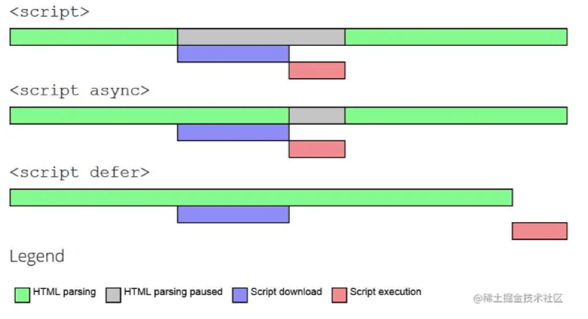

# html题目汇总

## 高频

1. html5有哪些更新
2. script标签中defer和async区别
3. 块级元素和行级元素的区别，分别有哪些

## 非高频

1. meta元素是用来干什么的？有哪些
2. html语义化是什么？有哪些优点？
3. 网站SEO怎么处理
4. src和href的区别

## 高频问题回答

### **html5更新**

https://github.com/LeoJiang1997/FrontEnd-InterView/issues/1

1. 媒体标签：音频（audio）、视频（video）

2. 表单标签：

     email ：能够验证当前输入的邮箱地址是否合法

     url ： 验证URL

     week ：周控件

     month：月控件

3. websocket：在单个 TCP 连接上进行全双工通讯的协议

4. Webstorage：localstorage、sessionStorage

5. Progress(进度条标签)，time时间标签，nav导航标签

### script标签中defer和async区别

https://github.com/LeoJiang1997/FrontEnd-InterView/issues/2

**script标签：**解析脚本的标签，单个script标签会阻碍html下方的标签解析。因为只有当下载并解析完脚本才会去继续解析html

**defer script标签：**推迟解析脚本标签，完全不会阻碍 HTML 的解析，解析完成之后再按照顺序执行脚本

**async script标签：**异步解析脚本标签，html解析过程中去下载执行脚本，脚本执行会阻碍html的解析

### 块级元素和行级元素的区别，分别有哪些

https://github.com/LeoJiang1997/FrontEnd-InterView/issues/3

**区别：**

块级元素可设置宽高，默认宽度为100%, 独占一行

行级元素不可设置宽高，默认宽度为文本内容宽度，行级元素相遇会在同一行

**块级元素：**div、p、h1-h6、ul、li、ol、

**行级元素：**span、a、label、input、i、textarea

## 非高频问题回答

### meta元素是用来干什么的？有哪些

https://github.com/LeoJiang1997/FrontEnd-InterView/issues/4

meta 元素被用于规定页面的描述、关键词、文档的作者、最后修改时间以及其他元数据。始终位于 head 元素中。属性有：name（和content一起使用，表示元数据名称） content （表示元数据值） charset（字符编码） http-equiv（定义了一个编译指示指令）

### html语义化是什么？有哪些优点？

https://github.com/LeoJiang1997/FrontEnd-InterView/issues/5

**语义化定义：**

html标签名具有实际意义，增加标签的可读性，例如header定义了文档头部，footer定义了文档尾部区域

**语义化优点：**

1. 增加代码可读性
2. 由于爬虫依赖于标签来确定上下文和各个关键字的权重，所以有助于爬虫抓取更多的有效信息
3. 页面能呈现较好的内容结构、代码结构

### 网站SEO怎么处理？

https://github.com/LeoJiang1997/FrontEnd-InterView/issues/6

1、meta 元数据要写好
2、首屏从服务端回来的时候有内容，可以借助 ssr 手段。
3、语义化标签

### src和href的区别

https://github.com/LeoJiang1997/FrontEnd-InterView/issues/7

**Src**

src常用于将外部资源嵌入指定位置，会阻碍js引擎的执行，常用于script脚本标签和img图片标签 

**Href**

href表明外部资源与该页面的联系，比如a标签link标签，不会阻碍js引擎的执行，

href代表网站的附属资源，没有不会对网站的核心逻辑和结构造成影响

