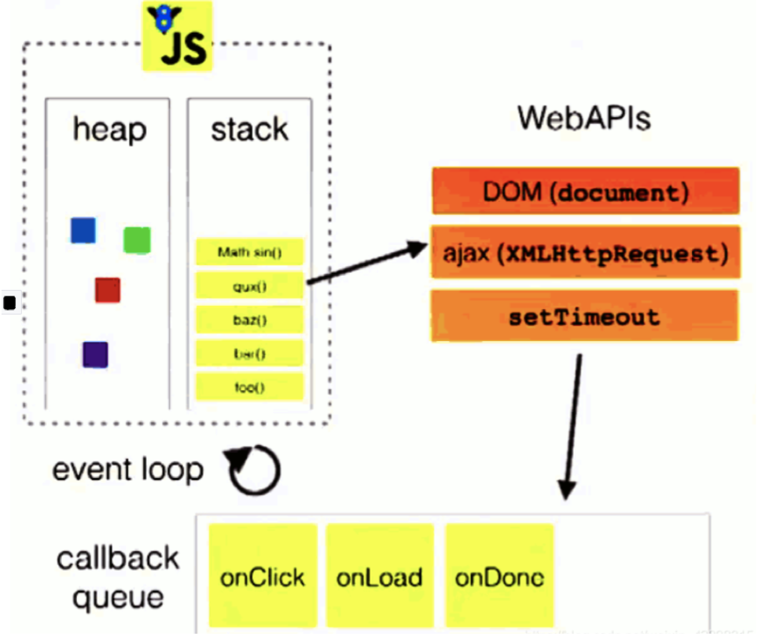
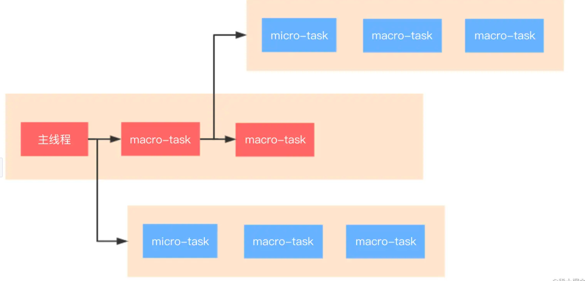
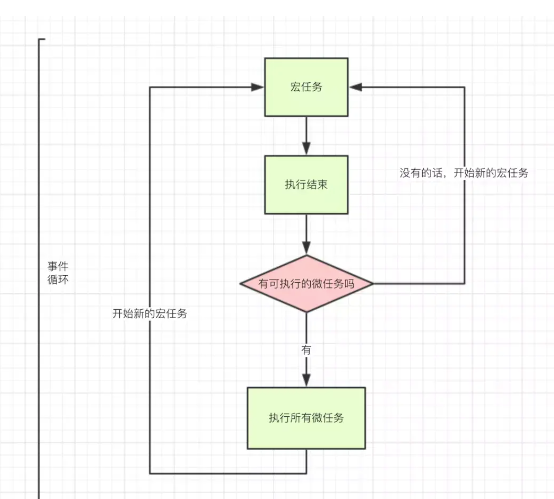
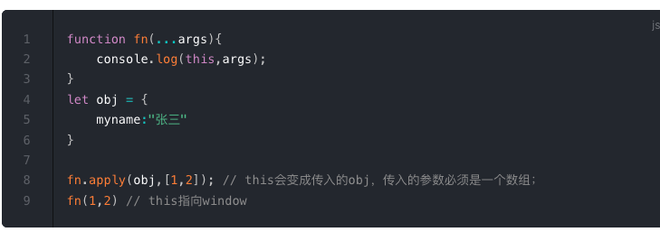
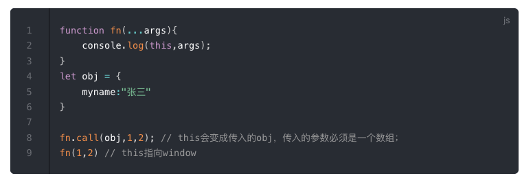
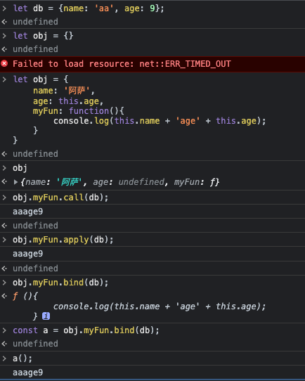
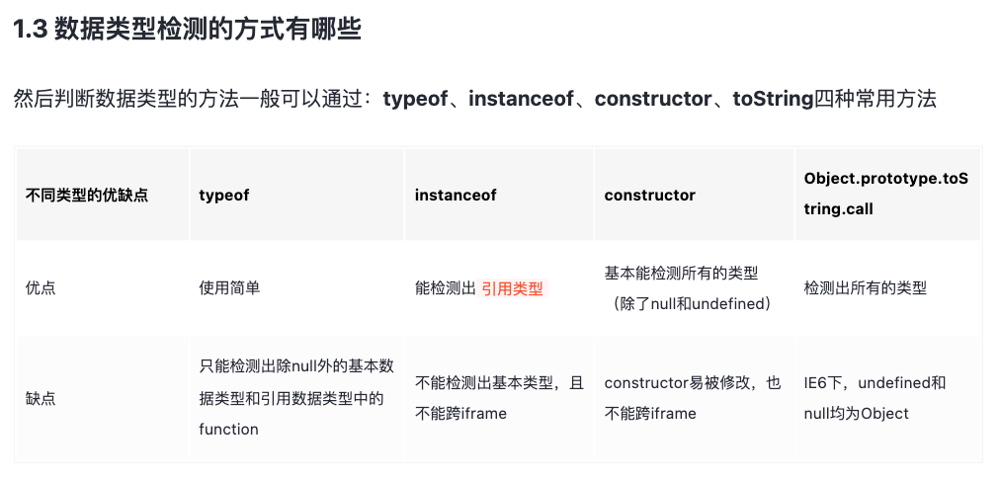
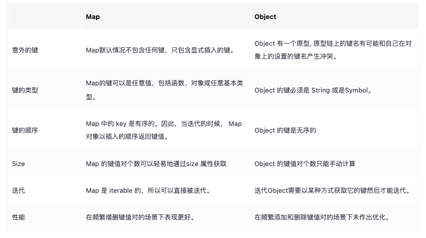

## 高频问题回答

### 讲一下事件循环机制和宏任务/微任务

#### js单线程

JavaScript的单线程，与它的用途有关。作为浏览器脚本语言，JavaScript的主要用途是与用户互动，以及操作DOM。这决定了它只能是单线程，否则会带来很复杂的同步问题。比如，假定JavaScript同时有两个线程，一个线程在某个DOM节点上添加内容，另一个线程删除了这个节点，这时浏览器应该以哪个线程为准？

所以，为了避免复杂性，从一诞生，JavaScript就是单线程，这已经成了这门语言的核心特征，将来也不会改变。

#### 同步和异步

单线程就意味着，所有任务需要排队，前一个任务结束，才会执行后一个任务。如果前一个任务耗时很长，后一个任务就不得不一直等着。考虑到这种情况，就有了异步。

所有任务可以分成两种，一种是同步任务（synchronous），另一种是异步任务（asynchronous）。同步任务指的是，在主线程上排队执行的任务，只有前一个任务执行完毕，才能执行后一个任务；**异步任务指的是，不进入主线程、而进入"任务队列"（task queue）的任务，只有"任务队列"通知主线程，某个异步任务可以执行了，该任务才会进入主线程执行**。具体来说，异步执行的运行机制如下：

1. 所有同步任务都在主线程上执行，形成一个执行栈（execution     context stack）。
2. 主线程之外，还存在一个"任务队列"（task     queue）。只要异步任务有了运行结果，就在"任务队列"之中放置一个事件。
3. 一旦"执行栈"中的所有同步任务执行完毕，系统就会读取"任务队列"，看看里面有哪些事件,哪些对应的异步任务，于是结束等待状态，进入执行栈，开始执行。
4. 主线程不断重复上面的第三步，只要主线程空了，就会去读取"任务队列"，这就是JavaScript的运行机制。这个过程会不断重复

#### 异步任务专门介绍

异步任务表明一个任务不是连续完成的，会先执行第一段，等第一段执行完毕，再回过头执行第二段，而第二段也被称为回调，同步则是连贯完成的，像读取文件，网络请求这种任务属于异步任务:中间的时间很长，但不需要js引擎去完成。它只需要等别人准备好了把数据给他，然后再执行回调，所以js在执行异步任务时，就会有很长等待时间。因此有了异步回调任务通知模式，而实现这种模式的，正是事件循环

#### 事件和回调函数

“任务队列"是一个事件的队列（也可以理解成消息的队列），IO设备完成一项任务，就在"任务队列"中添加一个事件，表示相关的异步任务可以进入"执行栈"了。主线程读取"任务队列”，就是读取里面有哪些事件。

“任务队列"中的事件，包括一些用户产生的事件（比如鼠标点击、页面滚动等等）、异步请求、定时器等等。只要指定过回调函数，这些事件发生时就会进入"任务队列”，等待主线程读取。

所谓"回调函数"（callback），就是那些会被主线程挂起来的代码。异步任务必须指定回调函数，当主线程开始执行异步任务，就是执行对应的回调函数。

#### 事件循环

主线程从"任务队列"中读取事件，这个过程是循环不断的，所以整个的这种运行机制又称为Event Loop（事件循环）


上图中，主线程运行的时候，产生堆（heap）和栈（stack），栈中的代码调用各种外部API，它们在"任务队列"中加入各种事件（click，load，done）。只要栈中的代码执行完毕，主线程就会去读取"任务队列"，依次执行那些事件所对应的回调函数。

执行栈中的代码（同步任务），总是在读取"任务队列"（异步任务）之前执行。请看下面这个例子。

```javascript
  var req = new XMLHttpRequest();
  req.open('GET', url);  
  req.onload = function (){};  
  req.onerror = function (){};  
  req.send();
```

上面代码中的req.send方法是Ajax操作向服务器发送数据，它是一个异步任务，意味着只有当前脚本的所有代码执行完，系统才会去读取"任务队列"。所以，它与下面的写法等价。

```javascript
  var req = new XMLHttpRequest();
  req.open('GET', url);
  req.send();
  req.onload = function (){};  
  req.onerror = function (){}; 
```

也就是说，指定回调函数的部分（onload和onerror），在send()方法的前面或后面无关紧要，因为它们属于执行栈的一部分，系统总是执行完它们，才会去读取"任务队列"。

#### 任务队列

任务队列又分为宏任务(每次执行栈执行的代码)和微任务(执行完当前任务后立即执行的任务)，宏任务大概包括：

- script(整体代码)
- setTimeout
- setInterval
- UI     render

微任务大概包括：

- process.nextTick
- Promise.then()
- Async/Await(实际就是promise)
- MutationObserver(html5新特性)




总的结论就是，执行宏任务，然后执行该宏任务产生的微任务，若微任务在执行过程中产生了新的微任务，则继续执行微任务，微任务执行完毕后，再回到宏任务中进行下一轮循环。




**两个细节：**

1. 引擎执行任务时永远不会进行渲染（render）。如果任务执行需要很长一段时间也没关系。仅在任务完成后才会绘制对     DOM 的更改。
2. 如果一项任务执行花费的时间过长，浏览器将无法执行其他任务，例如处理用户事件。因此，在一定时间后，浏览器会抛出一个如“页面未响应”之类的警报，建议你终止这个任务。这种情况常发生在有大量复杂的计算或导致死循环的程序错误时。

### 讲一下浏览器渲染过程

https://juejin.cn/post/6847902222349500430#heading-26

### 箭头函数的优点，和普通函数的区别

#### 定义

箭头函数在es6中提出，使用箭头函数，可以简化编码过程，使代码更加的简洁。

#### 箭头函数没有this

- 箭头函数没有this，假如访问this，则从外部进行获取

例如：

```javascript
let group = {
 title: "Our Group",
 students: ["John", "Pete", "Alice"],

 showList() {
  this.students.forEach(
   student => alert(this.title + ': ' + student)
  );
 }
};

group.showList();
```

此时的title和students指向函数外部的title和students

- 没有this也就意味着箭头函数不能用作构造器，不能使用new进行调用

#### 箭头函数没有arguments

arguments为函数中封装实参的类数组对象。在箭头函数中由于没有arguments，所以当进行箭头函数调用时arguments也从外部获取。

例如

```javascript
function defer(f, ms) {

 return function() {
  setTimeout(() => f.apply(this, arguments), ms);
 };
}

function sayHi(who) {
 alert('Hello, ' + who);
}

let sayHiDeferred = defer(sayHi, 2000);
sayHiDeferred("John"); // 2 秒后显示：Hello, John
```

假如是普通函数的话：

```javascript
function defer(f, ms) {
 return function(...args) {
  let ctx = this;
  setTimeout(function() {
   return f.apply(ctx, args);
  }, ms);
 };
}
```

在这里，我们必须创建额外的变量 args 和 ctx，以便 setTimeout 内部的函数可以获取它们。

 

#### 总结：

箭头函数：

- 箭头函数没有自己的this
- 没有 arguments
- 不能使用 new 进行调用

- 没有super
- 箭头函数没有prototype
- 箭头函数比普通函数更加简洁

### forin和forof

#### 区别

1. forin得到的是key，forof得到的是value
2. forin只能用于可枚举类型（对象，数组，字符串），forof只能用于可迭代类型（数组，字符串，map，set）

#### 原理

**forin：**forin迭代对象原型链上一切可以枚举的属性，因此性能会很差，且在使用时需要使用hasownproperty去剔除原型链上的公有属性

**forof：**利用了symbol.iterator的迭代器去进行实现，所以非迭代类型不能使用forof


### es6有哪些新更新

- let和const

- 解构赋值

- 扩展运算符…

- Async await

- Forin forof

- Symbol

- Set Weakset

- Map Weakmap

- 函数形参赋默认值

- Object.keys/values/entries

- 可选运算符？、模版字符串``

  

### 数组去重的方法有哪些

```javascript
let arr = [1,2,3,9,3,4,4,5,9,9,8];
//利用set和扩展运算符
let newArr = [...new Set(arr)];

//利用array.from
let newArr = Array.from(new Set(arr));

//利用find
let newArr = [];
let duplicateRemoval = () => {
  arr.forEach(num => {
    if(!newArr.find(newNum => newNum === num)){
      newArr.push(num);
    }
  });
}
duplicateRemoval();

//利用some
let newArr = [];
let duplicateRemoval = () => {
  arr.forEach(num => {
    if(!newArr.some(newNum => newNum === num)){
      newArr.push(num);
    }
  });
}
duplicateRemoval();

//利用IndexOf
let newArr = [];
let duplicateRemoval = () => {
  arr.forEach(num => {
    if(newArr.indexOf(num) === -1){
      newArr.push(num);
    }
  });
}
duplicateRemoval();

//利用every
let newArr = [];
let duplicateRemoval = () => {
  arr.forEach(num => {
    if(newArr.every(newNum => newNum !== num)){
      newArr.push(num);
    }
  });
}
duplicateRemoval();

//利用filter
let newArr = [];
let duplicateRemoval = () => {
  arr.forEach(num => {
    if(!newArr.filter(newNum => newNum === num)){
      newArr.push(num);
    }
  });
}
duplicateRemoval();
```


### 数组和字符串常用方法

**数组**

- splice()
- slice()
- push()
- pop()
- shift()
- unshift()
- concat()
- filter()
- map()
- some()
- every()

**字符串**

- ToLowerCase()  将字符串全部变为小写
- ToUpperCase() 字符串全部变为大写
- IndexOf() 从字符串头部开始寻找元素对应的位置
- LastIndexOf() 从字符串尾部开始寻找元素对应的位置
- charAt() 返回字符串对应位置的字符
- charCodeAt() 返回字符串对应位置字符的ASCII值
- Slice()  以新数组形式返回子字符串
- Split()  以指定操作符把字符串分割为字符串数组

### 深拷贝和浅拷贝的区别，如何实现一个深拷贝

浅拷贝：对于基本数据类型拷贝其值，对于引用类型，拷贝地址

深拷贝： 更深层次的拷贝也是指向不同的地址，两者之间不会相互影响

在JavaScript中，存在浅拷贝的现象有：

- Object.assign
- Array.prototype.slice(), Array.prototype.concat()

- 使用拓展运算符实现的复制

```javascript
function deepClone(target, qfHash = new WeakMap()) {
  // 处理null
  if (target === null) return target;
  // 处理日期
  if (target instanceof Date) return new Date(target);
  // 处理正则
  if (target instanceof RegExp) return new RegExp(target);
  // 处理DOM元素
  if (target instanceof HTMLElement) return target;
  // 处理原始类型和函数
  if (typeof target !== 'object') return target;
  /* 引用类型进行深拷贝*/
  // 需要拷贝当前对象时，先去存储空间中找，有的话直接返回
  if (qfHash.has(target)) return qfHash.get(target);
  // 创建一个新的克隆对象或克隆数组，存储进hash中
  const cloneTarget = new target.constructor();
  qfHash.set(target, cloneTarget);
  /* 引入Reflect.ownKeys处理Symbol作为键名的情况，且进行赋值 */
  Reflect.ownKeys(target).forEach(key => {
    cloneTarget[key] = deepClone(target[key], qfHash);
  });
  return cloneTarget;
}
```

### 防抖/节流

防抖：在事件被触发n秒后再执行回调，如果在这n秒内又被触发，则重新计时

```javascript
//防抖
function debounce(func, wait){
  let timeout;
  return function(){
    clearTimeout(timeout);
    
    timeout = setTimeout(function(){
      func.apply(this,arguments)
    }, wait);
  }
}
```

节流：稀释触发事件的频率，n秒内多次触发事件，只执行一次

```javascript
//节流
function throttle(fun,time){
  let t1 = 0;
  return function(){
    let t2 = +new Date();
    if(t2 - t1 > time){
      fun.apply(this, arguments);
      t1 = t2;
    }
  }
}
```


### bind、call、apply 的区别

#### call、apply

call、apply、bind作用是改变函数执行时的上下文，简而言之就是改变函数运行时的this指向

apply接受两个参数，第一个参数是this的指向，第二个参数是函数接受的参数，以数组的形式传入（改变参数原函数立即执行）


call方法的第一个参数也是this的指向，后面传入的是一个参数列表（改变参数原函数立即执行）


#### bind

bind方法和call很相似，第一参数也是this的指向，后面传入的也是一个参数列表(但是这个参数列表可以分多次传入)

改变this指向后不会立即执行，而是返回一个永久改变this指向的函数

 

apply接收的是数组，call接收的是参数列表，bind接收的是参数列表但不会立即执行，返回的是一个函数


### 判断数据类型的方法有哪些


## 非高频问题回答

### set和map的区别

1、**Map**是键值对，**Set**是值的集合

2、**Map**可以通过get方法获取值，而set不能因为它只有值

3、都能通过迭代器进行**for**...**of** 遍历 

4、**Set**的值是唯一的可以做数组去重，而**Map**由于没有格式限制，可以做数据存储

### map和对象的区别


### 执行上下文是什么

#### 定义

在代码执行阶段，js在执行前做的一些准备工作(例如变量的定义，作用域链的扩展，提供调用者的对象引用)，就叫做执行上下文(execution context)也称为可执行环境。

#### 执行上下文类型

1. 全局执行上下文

这是默认的执行上下文，一个程序中有且只有一个执行上下文，在js的生命周期内都存在于执行堆栈的底部并且不会被弹出销毁。全局上下文生成一个全局对象，并且将this绑定到这个全局对象上

2. 函数执行上下文

每当一个函数被调用执行时，都会创建一个新的函数执行上下文(只要被调用就会有，不管是否重复)

3. Eval执行上下文 

#### 执行栈

拥有后进先出的栈，被用来存储代码运行时创建的所有执行上下文，当js引擎开始执行脚本时，先将全局执行上下文压入当前执行栈，然后每当遇到一个函数调用，就将为该函数创建执行上下文并压入栈的顶部

#### 执行上下文内容

执行上下文在ES5中包括

- 词法环境：用于获取变量和函数
- 变量环境：用于存储变量和函数
- this

### this的定义和指向

#### 定义

是一个指针型变量，它动态指向当前函数的运行环境。在不同的场景中调用同一个函数，this的指向也可能会发生变化， 但是它永远指向其所在函数的真实调用者；如果没有调用者，就指向全局对象window。

#### this指向

1. 普通函数指向函数的调用者:

- 全局作用域下，this指向全局
- 假如作为对象的方法来进行调用，this指向这个对象
- 多层嵌套的对象，内部方法的this通过作用域链指向离被调用函数最近的对象。

2. 通过new进行调用时，指向这个新创建的对象
3. aplly，bind，call显示改变this的指向
4.  箭头函数没有this，它指向函数所在的所用域

### symbol类型是用来干嘛的，它的使用场景

Symbol 是唯一标识符的基本类型

Symbol 是使用带有可选描述（name）的 Symbol() 调用创建的。

Symbol 总是不同的值，即使它们有相同的名字。如果我们希望同名的 Symbol 相等，那么我们应该使用全局注册表：Symbol.for(key) 返回（如果需要的话则创建）一个以 key 作为名字的全局 Symbol。使用 Symbol.for 多次调用 key 相同的 Symbol 时，返回的就是同一个 Symbol。

Symbol 有两个主要的使用场景：

1. “隐藏” 对象属性。     如果我们想要向“属于”另一个脚本或者库的对象添加一个属性，我们可以创建一个 Symbol 并使用它作为属性的键。Symbol     属性不会出现在 for..in 中，因此它不会意外地被与其他属性一起处理。并且，它不会被直接访问，因为另一个脚本没有我们的     symbol。**因此，该属性将受到保护，防止被意外使用或重写**。
因此我们可以使用 Symbol 属性“秘密地”将一些东西隐藏到我们需要的对象中，但其他地方看不到它。
2. JavaScript 使用了许多系统 Symbol，这些 Symbol     可以作为 Symbol. 访问。我们可以使用它们来改变一些内建行为。

### 当一个函数被使用 new 操作符执行时，发生了什么

-  一个新的空对象被创建
- 将构造函数的作用域赋给新对象
- this 指向该对象，给对象添加新的属性。

- 返回 this 的值。

### 聊一聊垃圾回收机制，内存泄露有哪些情况

JavaScript 中主要的内存管理概念是 **可达性**。当某些数据具有可达性时，那么其一定是存储在内存中的。

**定义：**

垃圾回收的基本算法被称为 “mark-and-sweep”。

定期执行以下“垃圾回收”步骤：

- 垃圾收集器找到所有的根，并“标记”（记住）它们。
- 然后它遍历并“标记”来自它们的所有引用。
- 然后它遍历标记的对象并标记 **它们的** 引用。所有被遍历到的对象都会被记住，以免将来再次遍历到同一个对象。
- ……如此操作，直到所有可达的（从根部）引用都被访问到。
- 没有被标记的对象都会被删除。


**内存泄露：**

1、意外的全局变量：由于使用未声明的变量,而意外的创建了一个全局变量,而使这个变量一直留在内存中无法被回收

2、被遗忘的计时器或回调函数：设置了 setInterval定时器，而忘记取消它，如果循环函数有对外部变量的引用的话，那么这个变量会被一直留在内存中，而无法被回收。 

3、闭包：不合理的使用闭包，从而导致某些变量一直被留在内存当中。


### 原型和原型链是什么

原型 （显式）prototype

原型链（隐式） _proto_ 另一种写法： [[prototype]]

#### 定义：

- 原型链     _proto_是引用类型共有的,函数中会有一个特殊的属性prototype.
- 引用类型中都有一条原型链_proto_，它指向它的构造函数的显示原型（prototype）

​     **引用类型**有：数组，对象，日期，函数，正则等.

- 当你试图得到一个对象的某个属性时，如果这个对象本身没有这个属性，那么它会去它的隐式原型 __proto__（也就是它的构造函数的显式原型 prototype）中寻找

  

### ES6和commonJs的区别

####  ES6 和 commonjs 的区别？

- commonjs模块输出的是值的拷贝，而ES6输出的值是值的引用
- commonjs是在运行时加载，是一个对象，ES6是在编译时加载，是一个代码块
- commonjs的this指向当前模块，ES6的this指向undefined

#### require/import 之间的区别？

- require是CommonJS语法，import是ES6语法；

- require只在后端服务器支持，import在高版本浏览器及Node中都可以支持；

- require引入的是原始导出值的复制，import则是导出值的引用；

- require时运行时动态加载，import是静态编译；

- require调用时默认不是严格模式，import则默认调用严格模式.

  

### var、let、const 的区别

**var：**

var的三个缺陷：

1. 声明提升
2. 变量覆盖
3. 没有块级作用域

**Let：**

1. 可以只声明不赋值
2. 解决var的缺陷
3. 有块级作用域
4. 一般用于变量的声明

**const：**

1. const声明后必须赋值
2. 声明后的值不能被修改
3. 支持块级作用域
4. 一般用于常量的声明