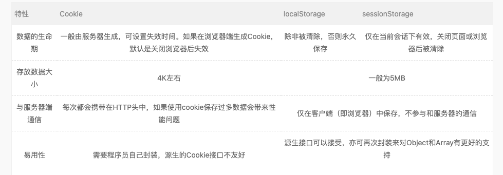
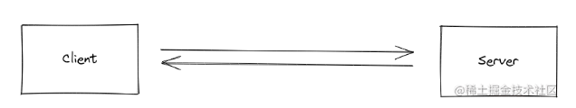

# 计算机网络

## 高频问题

1. cookie/sessionstorage/localstorage的区别
2. websocket和websocketIO
3. 说一下常见的状态码
4. 输入url时发生了什么
5. http常见请求头、响应头
6. 跨域是什么？解决的方式有哪些
7. 三次握手四次挥手
8. http和https的区别

## 非高频问题

1. CDN 是什么？描述下 CDN 原理？为什么要用 CDN?

2. 什么是 CORS，CORS 需要前端配置还是后端配置

3. 强缓存和协商缓存的理解

4. 请描述 CSRF、XSS 的基本概念、攻击原理和防御措施？

5. cookie 放哪里，cookie 能做的事情和存在的价值

6. DNS 解析的具体过程

   

## 高频问题答案

### cookie/sessionstorage/localstorage的区别

**定义**

Cookie 是直接存储在浏览器中的一小串数据。是http协议的一部分，通常由服务器使用set-cookie去进行HTTP-header设置。然后浏览器使用 Cookie HTTP-header 发送cookie。

**限制**

- encodeURIComponent 编码后的 name=value 对，大小不能超过     4KB。因此，我们不能在一个 cookie 中保存大的东西。
- 每个域的     cookie 总数不得超过 20+ 左右，具体限制取决于浏览器。

Cookie 有几个选项，其中很多都很重要，应该设置它,选项被列在 key=value 之后，以 ; 分隔，像这样：

document.cookie = "user=John; path=/; expires=Tue, 19 Jan 2038 03:14:07 GMT"

**Path**

url 路径前缀必须是绝对路径。它使得该路径下的页面可以访问该 cookie。默认为当前路径。

如果一个 cookie 带有 path=/admin 设置，那么该 cookie 在 /admin 和 /admin/something 下都是可见的，但是在 /home 或 /adminpage 下不可见。

通常，我们应该将 path 设置为根目录：path=/，以使 cookie 对此网站的所有页面可见。

**Expires,max-age**

默认情况下，如果一个 cookie 没有设置这两个参数中的任何一个，那么在关闭浏览器之后，它就会消失。此类 cookie 被称为 "session cookie”。

为了让 cookie 在浏览器关闭后仍然存在，我们可以设置 expires 或 max-age 选项中的一个。

- **expires=Tue, 19 Jan 2038 03:14:07 GMT**

cookie 的过期时间定义了浏览器会自动清除该 cookie 的时间。

如果我们将 expires 设置为过去的时间，则 cookie 会被删除。

- **max-age=3600**

它是 expires 的替代选项，指明了 cookie 的过期时间距离当前时间的秒数。

如果将其设置为 0 或负数，则 cookie 会被删除：

**sessionStorage**

- sessionStorage 的数据**只存在于当前浏览器标签页（包括同源的iframe）**,相当于会话存储
- 数据在页面刷新后仍然保留，但在关闭/重新打开浏览器标签页后不会被保留
- sessionstorage不仅绑定到源，还绑定到同一浏览器标签页，当在同源但非同一标签页内打开时，还是会得不到对应的值。
- 5M

 

**localStorage**

- 在同源的所有标签页和窗口之间共享数据。
- 数据不会过期。它在浏览器重启甚至系统重启后仍然存在。
- 5M

我们只需要在同一个源（域/端口/协议），URL 路径可以不同。在所有同源的窗口之间，localStorage 数据可以共享。因此，如果我们在一个窗口中设置了数据，则在另一个窗口中也可以看到数据变化。

**总区别：**

### websocket和websocketIo

**出现的原因：** 因为 HTTP 协议有一个缺陷：通信只能由客户端发起。

**作用：**服务器可以主动向客户端推送信息，客户端也可以主动向服务器发送信息，是真正的双向平等对话。

**定义：** 

WebSocket 是一种协议，是一种与 HTTP 同等的网络协议，两者都是应用层协议，都基于 TCP 协议。但是 WebSocket 是一种双向通信协议，在建立连接之后，WebSocket 的 server 与 client 都能主动向对方发送或接收数据。同时，WebSocket 在建立连接时需要借助 HTTP 协议，连接建立好了之后 client 与 server 之间的双向通信就与 HTTP 无关了。

**简单说明下WebSocket握手的过程**

当Web应用端调用new WebSocket(url)接口时，Browser就开始了与地址为URL的WebServer建立握手连接的过程。

1. Browser与WebSocket服务器通过TCP三次握手建立连接，如果这个建立连接失败，那么后面的过程就不会执行，Web应用将收到错误消息通知。
2. 在TCP建立连接成功后，Browser通过HTTP协议传送WebSocket支持的版本号、协议的字版本号、原始地址、主机地址等一系列字段给服务端。
3. WebSocket服务器收到Browser发送来的握手请求后，如果数据包数据和格式正确，客户端和服务端的协议版本匹配等，就接受本次握手连接，并给出对应的数据回复，同样回复的数据包也是采用HTTP协议传输。
4. Browser收到服务器回复的数据包后，如果数据包内容、格式都没有问题的话，就表示本次连接成功，触发onopen消息，此时Web开发者就可以在此时通过send接口向服务器发送数据。否则，握手连接失败，Web应用会收到onerror消息，并且能知道连接失败的原因。

**socketIo**

Socket.IO 是一个库，可以在客户端和服务器之间实现 **低延迟**, **双向** 和 **基于事件的** 通信。

它建立在 websocket协议之上，并提供额外的保证，例如回退到 HTTP 长轮询或自动重新连接。