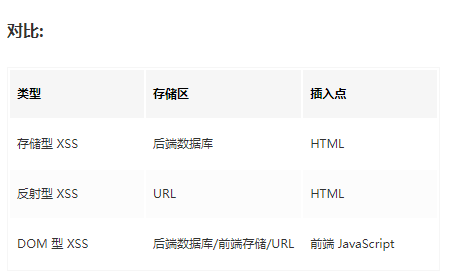

# 计算机网络

## 高频问题

1. cookie/sessionstorage/localstorage的区别
2. websocket和websocketIO
3. 说一下常见的状态码
4. 输入url时发生了什么
5. http常见请求头、响应头
6. 跨域是什么？解决的方式有哪些
7. 三次握手四次挥手
8. http和https的区别

## 非高频问题

1. CDN 是什么？描述下 CDN 原理？为什么要用 CDN?

2. 什么是 CORS，CORS 需要前端配置还是后端配置

3. 强缓存和协商缓存的理解

4. 请描述 CSRF、XSS 的基本概念、攻击原理和防御措施？

5. cookie 放哪里，cookie 能做的事情和存在的价值

6. DNS 解析的具体过程

   

## 高频问题答案

### cookie/sessionstorage/localstorage的区别

**定义**

Cookie 是直接存储在浏览器中的一小串数据。是http协议的一部分，通常由服务器使用set-cookie去进行HTTP-header设置。然后浏览器使用 Cookie HTTP-header 发送cookie。

**限制**

- encodeURIComponent 编码后的 name=value 对，大小不能超过     4KB。因此，我们不能在一个 cookie 中保存大的东西。
- 每个域的     cookie 总数不得超过 20+ 左右，具体限制取决于浏览器。

Cookie 有几个选项，其中很多都很重要，应该设置它,选项被列在 key=value 之后，以 ; 分隔，像这样：

document.cookie = "user=John; path=/; expires=Tue, 19 Jan 2038 03:14:07 GMT"

**Path**

url 路径前缀必须是绝对路径。它使得该路径下的页面可以访问该 cookie。默认为当前路径。

如果一个 cookie 带有 path=/admin 设置，那么该 cookie 在 /admin 和 /admin/something 下都是可见的，但是在 /home 或 /adminpage 下不可见。

通常，我们应该将 path 设置为根目录：path=/，以使 cookie 对此网站的所有页面可见。

**Expires,max-age**

默认情况下，如果一个 cookie 没有设置这两个参数中的任何一个，那么在关闭浏览器之后，它就会消失。此类 cookie 被称为 "session cookie”。

为了让 cookie 在浏览器关闭后仍然存在，我们可以设置 expires 或 max-age 选项中的一个。

- **expires=Tue, 19 Jan 2038 03:14:07 GMT**

cookie 的过期时间定义了浏览器会自动清除该 cookie 的时间。

如果我们将 expires 设置为过去的时间，则 cookie 会被删除。

- **max-age=3600**

它是 expires 的替代选项，指明了 cookie 的过期时间距离当前时间的秒数。

如果将其设置为 0 或负数，则 cookie 会被删除：

**sessionStorage**

- sessionStorage 的数据**只存在于当前浏览器标签页（包括同源的iframe）**,相当于会话存储
- 数据在页面刷新后仍然保留，但在关闭/重新打开浏览器标签页后不会被保留
- sessionstorage不仅绑定到源，还绑定到同一浏览器标签页，当在同源但非同一标签页内打开时，还是会得不到对应的值。
- 5M

 

**localStorage**

- 在同源的所有标签页和窗口之间共享数据。
- 数据不会过期。它在浏览器重启甚至系统重启后仍然存在。
- 5M

我们只需要在同一个源（域/端口/协议），URL 路径可以不同。在所有同源的窗口之间，localStorage 数据可以共享。因此，如果我们在一个窗口中设置了数据，则在另一个窗口中也可以看到数据变化。

**总区别：**

### websocket和websocketIo

**出现的原因：** 因为 HTTP 协议有一个缺陷：通信只能由客户端发起。

**作用：**服务器可以主动向客户端推送信息，客户端也可以主动向服务器发送信息，是真正的双向平等对话。

**定义：** 

WebSocket 是一种协议，是一种与 HTTP 同等的网络协议，两者都是应用层协议，都基于 TCP 协议。但是 WebSocket 是一种双向通信协议，在建立连接之后，WebSocket 的 server 与 client 都能主动向对方发送或接收数据。同时，WebSocket 在建立连接时需要借助 HTTP 协议，连接建立好了之后 client 与 server 之间的双向通信就与 HTTP 无关了。

**简单说明下WebSocket握手的过程**

当Web应用端调用new WebSocket(url)接口时，Browser就开始了与地址为URL的WebServer建立握手连接的过程。

1. Browser与WebSocket服务器通过TCP三次握手建立连接，如果这个建立连接失败，那么后面的过程就不会执行，Web应用将收到错误消息通知。
2. 在TCP建立连接成功后，Browser通过HTTP协议传送WebSocket支持的版本号、协议的字版本号、原始地址、主机地址等一系列字段给服务端。
3. WebSocket服务器收到Browser发送来的握手请求后，如果数据包数据和格式正确，客户端和服务端的协议版本匹配等，就接受本次握手连接，并给出对应的数据回复，同样回复的数据包也是采用HTTP协议传输。
4. Browser收到服务器回复的数据包后，如果数据包内容、格式都没有问题的话，就表示本次连接成功，触发onopen消息，此时Web开发者就可以在此时通过send接口向服务器发送数据。否则，握手连接失败，Web应用会收到onerror消息，并且能知道连接失败的原因。

**socketIo**

Socket.IO 是一个库，可以在客户端和服务器之间实现 **低延迟**, **双向** 和 **基于事件的** 通信。

它建立在 websocket协议之上，并提供额外的保证，例如回退到 HTTP 长轮询或自动重新连接。

### 说一下常见的状态码

1**开头**

表示临时响应并需要请求者继续执行

100 （继续） 请求者应当继续提出请求。 服务器返回此代码表示已收到请求的第一部分，正在等待其余部分。

101： （切换协议）请求者要求服务器切换协议，服务器已确认并准备切换，比如http转ws

2**开头**

表示成功处理了请求的状态代码。

200 服务器已成功处理了请求。 通常，这表示服务器提供了请求的网页

3**开头**

表示重定向

http状态码 301 （永久移动） 请求的网页已永久移动到新位置。 服务器返回此响应（对 GET 或 HEAD 请求的响应）时，会自动将请求者转到新位置。

http状态码 302 （临时移动） 服务器目前从不同位置的网页响应请求，但请求者应继续使用原有位置来进行以后的请求。

http状态码 304 （表示未修改，使用协商缓存时会出现） 自从上次请求后，请求的网页未修改过。 服务器返回此响应时，不会返回网页内容。

4**开头**

http状态码 400 （错误请求）

http状态码 401 （未授权） 请求要求身份验证。 对于需要登录的网页，服务器可能返回此响应。

http状态码 403 （禁止） 服务器拒绝请求。（访问内网时可能返回403，跨域）

http状态码 404 （未找到） 服务器找不到请求的网页。

5**开头**

表示服务器错误

http状态码 500 （服务器内部错误） 服务器遇到错误，无法完成请求。

http状态码 501 （尚未实施） 服务器不具备完成请求的功能。 例如，服务器无法识别请求方法时可能会返回此代码。

http状态码 502 （错误网关，运维配置错误，数据库死锁） 服务器作为网关或代理，从上游服务器收到无效响应。

http状态码 503 （服务不可用） 服务器目前无法使用（服务器停机维护）。 通常，这只是暂时状态。

### 输入url时发生了什么

https://juejin.cn/post/6844904054074654728

### http常见请求头、响应头

**请求头：**

- connection浏览器和服务器之间的连接类型
- accept-language浏览器当前设置的语言
- token用于身份验证，是服务器生成的一串身份令牌
- content-length内容长度
- canche-control缓存策略
- user-agent客户端使用的操作系统和浏览器的名称版本

**响应头：**

- date服务端发送资源时的服务器时间
- content-type返回内容类型
- server：服务器类型
- canche-control： 缓存策略
- expires: 强缓存有效期
- etag： 保证请求资源是唯一的，主要用来判断请求资源是否发生改变
- last-modified：请求内容上次调整时间
- etag： 保证请求资源是唯一的，主要用来判断请求资源是否发生改变

### 跨域是什么？解决的方式有哪些

**同源：**

讲到跨域就需要讲到同源策略，

那么什么是同源策略呢？

在不同源的情况下，限制了从A源加载的资源与来自B源的资源进行交互。这是一个用于隔离潜在恶意文件的重要安全机制。

同源是指"协议+域名+端口"三者相同

**跨域：**，受同源策略限制，不能执行其他网站的资源。

**解决方式：**

proxy/cors/jsonp

### 三次握手四次挥手

https://juejin.cn/post/7045059219216662564

### http和https的区别

**定义**

**http:** 超文本传输协议(Hypertext Transfer Protocol)，是互联网上应用最为广泛的一种网络协议，为应用层协议，是一个客户端和服务器端请求和应答的标准（TCP），它是一个在计算机世界里专门在两点之间传输文字、图片、音频、视频等超文本数据的约定和规范。

 

**https** 的全称是 Hypertext Transfer Protocol Secure , 它用来在计算机网络上的两个端系统之间进行安全的交换信息(secure communication). HTTPS 是 HTTP 协议的一种扩展，它本身并不保证传输的安全性，那么谁来保证安全性呢？在 HTTPS 中，使用传输层安全性(TLS)或安全套接字层(SSL)对通信协议进行加密。也就是 HTTP + SSL(TLS) = HTTPS。

 

**SSL**:(Secure Sockets Layer) 安全套接字层，是对TCP协议的一种加强，这种强化在应用层上进行实现，当一个应用使用SSL时，将明文数据传递给SSL，SSL对其进行加密，并将加密数据传递给TCP套接字.该套接字再将加密数据传递给SSL进行解密。最后SSL套接字将明文数据传递给接收进程。

 **http 和 https 的区别**

- https 协议需要 ca     证书，费用较高
- http     数据信息是明文传输，https 则是具有安全性的 ssl 加密传输协议
- 使用不同的链接方式，端口也不同，一般而言，http     协议的端口为 80 , https 的端口为 443
- http     的连接很简单，是无状态的；https 握手阶段比较费时
- https 因为存在加密，所以缓存不如 http 高效，会增加数据开销。

## 非高频问题答案：

### CDN 是什么？描述下 CDN 原理？为什么要用 CDN?

**定义：**

CDN的全称是Content Delivery Network，即内容分发网络。CDN是构建在`现有网络基础之上的智能虚拟网络`，依靠部署在各地的`边缘服务器`，`使用户就近获取所需内容`，`提高用户访问响应速度和命中率`。

**CDN原理：**

https://juejin.cn/post/7064952956201730062

### 什么是 CORS，CORS 需要前端配置还是后端配置

**cors**

目前主流的方案，全称是"跨域资源共享"（Cross-origin resource sharing），浏览器一旦发现跨域请求，就会添加一些附加的头信息，

通过设置响应头Access-Control-Allow-xxx字段来设置访问的白名单、可允许访问的方式等

### 强缓存和协商缓存的理解

**强缓存：**

在第一次请求资源时，服务器返回所请求资源与有效时间，浏览器将其缓存在本地，在第二次请求该资源时， 浏览器判断该资源是否在有效期中，如果在有效期就直接调用该资源，不向服务端发起请求。

强缓存是利用http头中的Expires和Cache-Control两个字段来控制的，Expires是http1.0的规范，设置的是毫秒数，Cache-Control是在http1.1中出现的，设置的是秒数

**协商缓存：**

与强缓存不同的是，强缓存是在时效时间内，不走服务端，只走本地缓存；而协商缓存是要走服务端的，如果请求某个资源，去请求服务端时，发现请求资源未修改过（也就是未命中缓存）则返回304，否则则返回所请求的资源

主要涉及到两组header字段：Etag和If-None-Match、Last-Modified和if-modified-since

### 请描述 CSRF、XSS 的基本概念、攻击原理和防御措施？

**XSS:**

**什么是 XSS**

Cross-Site Scripting（跨站脚本攻击）简称 XSS，是一种**代码注入攻击**。攻击者通过在目标网站上注入恶意脚本，使之在用户的浏览器上运行。利用这些恶意脚本，攻击者可获取用户的敏感信息如 Cookie、SessionID 等，进而危害数据安全。

所以,网页上哪些部分会引起XSS攻击?简单来说,任何可以输入的地方都有可能引起,包括URL!

XSS 常见的注入方法：

- 在 HTML 中内嵌的文本中，恶意内容以 script     标签形成注入。
- 在内联的 JavaScript     中，拼接的数据突破了原本的限制（字符串，变量，方法名等）。
- 在标签属性中，恶意内容包含引号，从而突破属性值的限制，注入其他属性或者标签。
- 在标签的 href、src 等属性中，包含     javascript: (伪协议)等可执行代码。
- 在 onload、onerror、onclick     等事件中，注入不受控制代码。
- 在 style 属性和标签中，包含类似     background-image:url("javascript:..."); 的代码（新版本浏览器已经可以防范）。
- 在 style 属性和标签中，包含类似     expression(...) 的 CSS 表达式代码（新版本浏览器已经可以防范）。

**XSS 攻击的分类**

根据攻击的来源，XSS 攻击可分为存储型、反射型和 DOM 型三种。

**常用防范方法**

- **httpOnly**：cookie中设置httpOnly属性
- **输入过滤：**一般是用于对于输入格式的检查，例如：邮箱，电话号码，用户名，密码……等，按照规定的格式输入

- **转义 HTML:** 如果拼接 HTML 是必要的，就需要对于引号，尖括号，斜杠进行转义

- **白名单:** 对于显示富文本来说，不能通过上面的办法来转义所有字符，因为这样会把需要的格式也过滤掉。这种情况通常采用白名单过滤的办法

**什么是 CSRF**

跨站请求伪造（英语：Cross-site request forgery），也被称为 one-click attack 或者 session riding，通常缩写为 CSRF 或者 XSRF， 是一种挟制用户在当前已登录的 Web 应用程序上执行非本意的操作的攻击方法。如:攻击者诱导受害者进入第三方网站，在第三方网站中，向被攻击网站发送跨站请求。利用受害者在被攻击网站已经获取的注册凭证，绕过后台的用户验证，达到冒充用户对被攻击的网站执行某项操作的目的。

**CSRF的特点**

- 攻击一般发起在第三方网站，而不是被攻击的网站。被攻击的网站无法防止攻击发生。
- 攻击**利用受害者在被攻击网站的登录凭证，冒充受害者提交操作**；而不是直接窃取数据。
- 整个过程攻击者并不能获取到受害者的登录凭证，仅仅是“冒用”。
- 跨站请求可以用各种方式：图片URL、超链接、CORS、Form提交等等。部分请求方式可以直接嵌入在第三方论坛、文章中，难以进行追踪。

CSRF通常是跨域的，因为外域通常更容易被攻击者掌控。但是如果本域下有容易被利用的功能，比如可以发图和链接的论坛和评论区，攻击可以直接在本域下进行，而且这种攻击更加危险。

**CSRF与 XSS 区别**

- 通常来说 CSRF 是由 XSS 实现的，CSRF 时常也被称为 XSRF（CSRF 实现的方式还可以是直接通过命令行发起请求等）。
- 本质上讲，XSS 是代码注入问题，**CSRF 是 HTTP 问题。** XSS 是内容没有过滤导致浏览器将攻击者的输入当代码执行。CSRF 则是因为浏览器在发送 HTTP 请求时候自动带上 cookie，而一般网站的 session 都存在 cookie里面(Token验证可以避免)。

### cookie 放哪里，cookie 能做的事情和token的区别

**Cookie：**

我们都知道一般接口但是通过 HTTP 协议来进行数据交换的，而 HTTP 协议的特点是，无状态，工作前通过三次握手建立连接，工作完成后立刻通过四次挥手断开连接，每次连接都是独立存在的，没有任何状态将请求串联成一个整体，因此每次都需要重新验证是身份，即耗费了性能，也给黑客的攻击留下隐患。

**作用：**

就是来弥补 HTTP 无状态的问题的，Cookie 可以作为一个状态保存的状态机，用来保存用户的相关登录状态，当第一次验证通过后，服务器可以通过 set-cookie 令客户端将自己的 cookie  保存起来，当下一次再发送请求的时候，直接带上 cookie 即可，而服务器检测到客户端发送的 cookie 与其保存的 cookie 值保持一致时，则直接信任该连接，不再进行验证操作

**token：**

类似 cookie 的一种身份令牌，客户端通过登录验证后，服务器会返回给客户端一个加密的 token，然后当客户端再次向服务器发起连接时，带上token，服务器直接对token进行校验即可完成权限校验。

**有了 Cookie 为什么还需要 Token**

cookie存在跨域限制以及xss这种安全性问题。相较于 Cookie，token 需要用户自行存储，自己进行发送，不存在跨域限制，因此 Token 更加的灵活。cookie存储大小只有4kb，因为一般只存储用户id，其他的用户信息都存储在服务器的session上，所以如果用户量非常大，这对于服务器来说，将会造成非常大的性能压力，而token将用户信息返回给客户端各自存储，也就完全避免了这个问题

### DNS 解析的具体过程

https://juejin.cn/post/7143491257698877471

### TCP和UDP的区别

